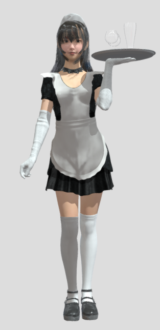

  

  <h1>Hi there, I'm Kodel </h1>
  
  

 

  
  
  

  
  

 

<table align="center" border="0" cellpadding="0" cellspacing="0">
  <tr>
    <td width="50%" valign="top">
      <h3>⚡ About Me</h3>
       
      <ul>
        <li>🎮 Passionate about: <b>Interactive Games & Simulation</b></li>
        <li>🧠 Currently Learning: <code style="color:#00ffc3">C++</code>, <code style="color:#00ffc3">Unity</code>, <code style="color:#00ffc3">React</code></li>
        <li>🎨 Hobbies: <b>3D Modeling & Level Design</b></li>
        <li>🌙 Fun fact: <i>"I commit my best code while the world sleeps."</i></li>
        <li>🚀 Goal: Building immersive digital experiences.</li>
      </ul>
    </td>
    <td width="50%" align="center">
      
    </td>
  </tr>
</table>

 

<h3 align="center">💻 Tech Stack & Tools</h3>

  

 

<h3 align="center">🖼️ 3D Showcase (Sketchfab)</h3>

  
   
  

    ✨ <a href="https://sketchfab.com/3d-models/high-quality-maid-model-for-games-4b46ace4d9c748cda18a6c2f751850b1"><b>High-Quality Maid Model</b></a> by <a href="https://sketchfab.com/dev-kodel"><b>dev-kodel</b></a> ✨
  

 

<h3 align="center">📊 GitHub Statistics</h3>

  <table border="0">
    <tr>
      <td>
        
      </td>
    </tr>
  </table>
   

 

<h3 align="center">🐍 Contribution Activity</h3>

  

 

  
    
  <i>"Code is like humor. If you have to explain it, it's bad."</i>

